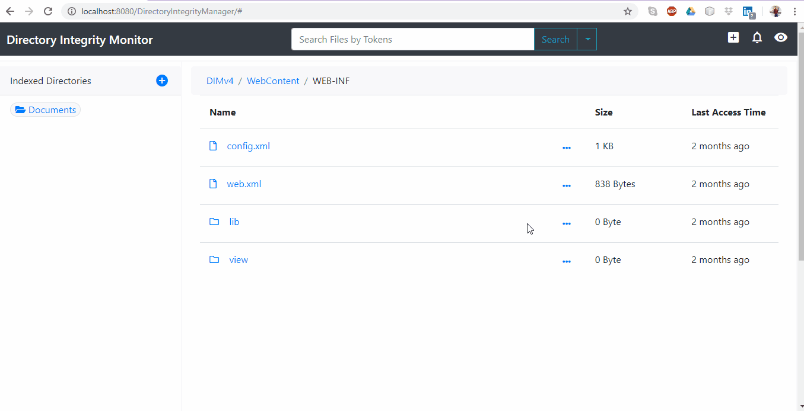
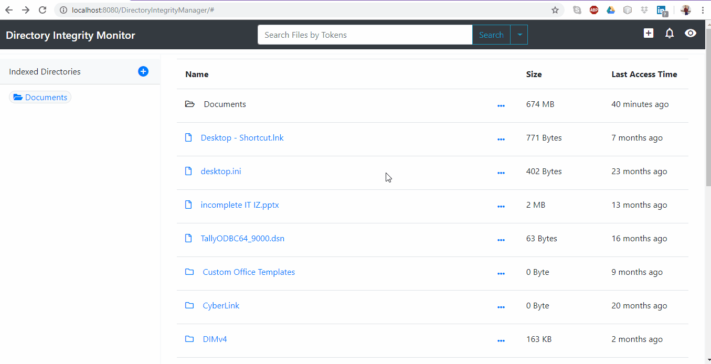
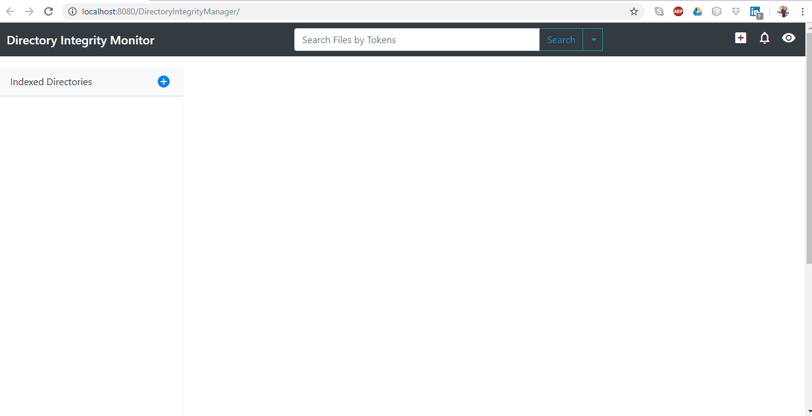
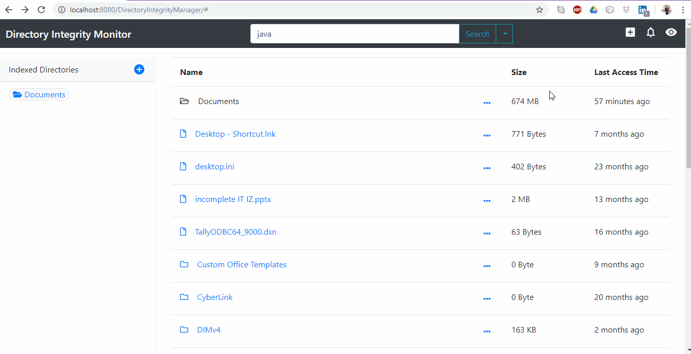
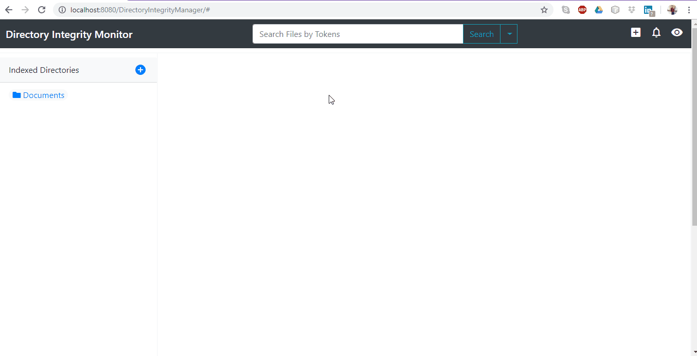

# Directory-Explorer

 - Directory Explorer, Indexer and Monitor.
 - A file or directory indexer with which you can index your local files and folders.
 - It enables you to explore, view, download, monitor and analyze your files’ tokenized data with several visualizations (e.g pie chart, word cloud etc.).
 - It can be used as an advanced remote storage drive.
 - Developed using Spring Boot, REST, AJAX & BootStrap.
 - It provides efficient indexing with watchers to monitor such that it takes only a few minutes to process 100s of GBs of data.

## Screenshots - 

 - User can find all of data about an indexed file or directory be it it's content, tokens (count and frequency w.r.t other files and itself) or meta data like creation date, with different visualizations.

 - User is able to search by parameters like token_name, file_name, file_extension, creation_date, modified_date and accessed_date with very efficient response time.
 

 - User can index multiple directories very fast with dynamic progress shown to the user. An indexed directory will have all of it's sub directories and files indexed till the end of directory tree.
 

 - All the indexed files and directories are monitored. If any CRUD operation is performed on them, user will get a detailed notification.
 

 - It can also be used as a file explorer with flexible navigation.
 

